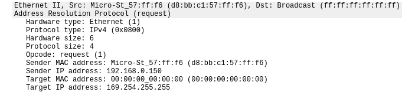

# Protocolul ARP

După ce un router a determinat următorul hop pentru un pachet folosind LPM,
trebuie să-l trimită mai departe, încapsulându-l într-un cadru cu adresa MAC
destinație setată ca cea a următorului hop. Cum știe routerul această adresă?

ta opțiune este ca această să fie reținută static, într-un tabel.

În realitate, însă, din mai multe motive (e.g. flexibilitate), routerul
*nu știe* aceste adrese, ci trebuie să le determine folosind protocolul
ARP ([RFC 826](https://www.rfc-editor.org/rfc/rfc826)). Având adresa IP a următorului hop precum și
identificatorul interfeței care duce la acesta, routerul generează un
mesaj de broadcast în rețeua respectivă, întrebând care e adresa MAC
asociată acelei adrese IP. Mașina respectivă observă că este vorba de
propriul său IP și îi trimite routerului un mesaj cu propria adresă MAC.
Acum routerul poate forma cadrul corespunzător; deasemena, păstrează
într-un cache adresa MAC primită, pentru un interval limitat de timp.

Protocolul ARP este deci relevant în două puncte: atunci când primim un
pachet cu antet ARP și atunci când trebuie să rescriem pentru forwardare
un pachet IPv4.

Antetul protocolului ARP este următorul:
```
0        7        15       23       31
+--------+--------+--------+--------+
|       HTYPE     |       PTYPE     |  HTYPE - Format of hardware address
+--------+--------+--------+--------+  PTYPE - Format of protocol address
|  HLEN  |  PLEN  |        OP       |  HLEN - Length of hardware address (6 for MAC)
+--------+--------+--------+--------+  PLEN - Length of protocol address (4 for IP)
|         SHA (bytes 0-3)           |  OP - ARP opcode (command, request or reply)
+--------+--------+--------+--------+  SHA - Sender hardware address
| SHA (bytes 4-5) | SPA (bytes 0-1) |  SPA - Sender IP address
+--------+--------+--------+--------+  THA - Target hardware address
| SPA (bytes 2-3) | THA (bytes 0-1) |  TPA - Target IP address
+--------+--------+--------+--------+
| THA (bytes 2-3) | THA (bytes 4-5) |
+--------+--------+--------+--------+
|         TPA (bytes 0-3)           |
+--------+--------+--------+--------+
```

Următoarea structura poate fi folosită pentru a reprezenta acest header în C:

```C
/* Ethernet ARP packet from RFC 826 */
struct arp_header {
    uint16_t htype;   /* Format of hardware address. */
    uint16_t ptype;   /* Format of protocol address. */
    uint8_t hlen;    /* Dimensiunea adrese hardware 6 bytes pentru MAC */
    uint8_t plen;    /* Dimensiunea adresei protocolului (IPV4). 4 bytes petnru IP */
    uint16_t op;    /* ARP opcode */
    uint8_t sha[6];  /* Adresa hardware (MAC) sender */
    uint32_t spa;   /* Adresa IP sender */
    uint8_t tha[6];  /* Adresa hardware target */
    uint32_t tpa;   /* Adresa IP target */
} __attribute__((packed));
```

> Noi vom folosi ARP pentru a determina adresa MAC a unui host având adresa IPv4
a acestuia. Parametrii folosiți de ARP precum `op` sau `htype` îi găsiți
[documentati de
IANA](https://www.iana.org/assignments/arp-parameters/arp-parameters.xhtml).
Cum facem translația din adrese IPv4, în `ptype` vom folosi identificatorul IPv4 conform [RFC
5342](https://www.rfc-editor.org/rfc/rfc5342.html#appendix-B). `hlen` reprezintă
dimensiunea adresei hardware, in acest caz adresa MAC are `6 bytes`.  `plen`
reprezintă adresa protocolului de nivel network, în acest caz `IPv4`.

Exemplu de pachet de tip ARP request capturat cu Wireshark:



Pașii relevanți pentru dirijarea unui pachet IPv4 sunt următorii:

1.  **Căutare în cache:** routerul se uită în cache-ul său ARP pentru a
    vedea dacă există o intrare curentă pentru adresa IPv4 a următorului
    hop. Dacă aceasta există, routerul o ia din cache, rescrie antetul
    L2 al pachetului și îl trimite mai departe.

2.  **Salvare pachet pentru mai târziu:** dacă adresa necesară nu se
    găsește în cache-ul ARP, routerul va trebui să facă o interogare
    generând un pachet ARP și așteptând un răspuns. Pachetul original
    care trebuia dirijat este adăugat într-o coadă, pentru a putea fi
    trimis mai târziu, după sosirea răspunsului ARP.

3.  **Generare ARP request:** routerul generează un pachet de tip ARP
    pentru a interoga despre adresa MAC a mașinii cu adresa IPv4 a
    următorului hop. Pentru asta are nevoie să genereze un pachet cu un
    antet Ethernet, urmat de un antet ARP.

    -   **Antetul Ethernet:** trebuie să conțină un `ethertype` care să
        identifice un pachet de tip ARP (`0x806`). Adresa MAC sursă va
        fi adresa interfeței routerului către next hop; adresa MAC
        destinație va fi cea de broadcast (`FF:FF:FF:FF:FF:FF`).

    -   **Antetul ARP:** trebuie să conțină tipul de adresă folosit în
        căutare (IPv4) împreună cu adresa în sine, precum și tipul de
        adresă căutată (MAC) împreună cu adresa în sine. Pentru mai
        multe detalii, consultați [@arprfc]

4.  **Parsează ARP reply.** Atunci când routerul primește un pachet de
    tip ARP reply, îl va adăuga în cache-ul ARP local. În plus, routerul
    va parcurge lista de pachete care așteaptă răspunsuri ARP și le va
    trimite pe cele pentru care adresa următorului hop este cunoscută.

> Un `ARP Request` către router poate avea ca destinație broadcast sau adresa MAC a interfeței router-ului.

În slideshow-ul de mai jos găsiți un exemplu de utilizare a protocolului ARP
pentru a determina adresa MAC a unui dispozitiv la care suntem direct conectați.

<iframe class="is-fullwidth" height="600" marginheight="0" marginwidth="0" src="slides/index.html">
</iframe>

> În mod normal, hoștii sunt conectați la un switch, astfel ARP Request-ul
este trimis la mai mai multe dispozitive, nu doar la router.
