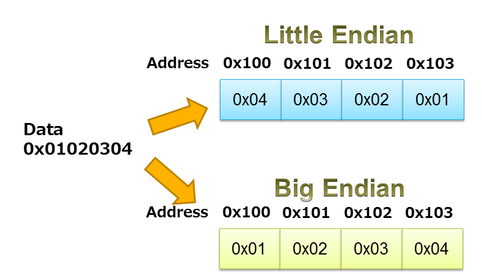

# Endianness

Toate datele pe care le vom primi de pe un link sunt în `Network Order`, pe când procesorul de pe calculatorul nostru lucrează în `Host Order`. Astfel, când o să afișăm tipuri de date mai mari de un byte, va trebui să
le trecem în host order cu funcții precum `ntohl`.

În același fel, atunci când completăm diferitele headere, va trebui să o facem în `Network Order`, altfel celelalte dispozitive din internet care folosesc această reprezentare le vor interpreta greșit. De exemplu,
atunci când completăm câmpul `ethertype` din header-ul Ethernet, vom folosi `eth_hdr->ether_type = htons(ETHERTYPE_ARP);` unde `ETHERTYPE_ARP` este `0x0806`.


```C
#include <arpa/inet.h>

// host to network long
uint32_t htonl(uint32_t hostlong);
uint16_t htons(uint16_t hostshort);
// network to host long
uint32_t ntohl(uint32_t netlong);
uint16_t ntohs(uint16_t netshort)
```



