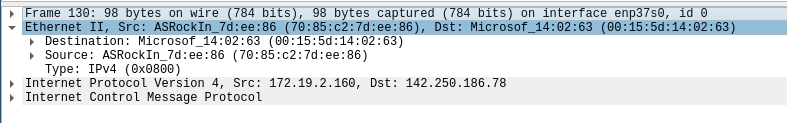

# Ethernet

Ethernet este echivalentul protocolului de DataLink pe care l-am implementat în
primele laboratoare. Noi vom lucra doar cu **cadre Ethernet** ce sunt transmise
ca payload peste implementarea protocolului de nivel fizic Ethernet. Cum CRC-ul
este calculat în hardware, nu o să îl regăsim în header. În acest caz, header-ul
pe care îl vom folosi este următorul:

```
Ethernet L2 Frame Header
+-----------------+------------+-------------+
|     Bytes 0-5   | Bytes 6-11 | Bytes 12-13 |
+------------------------------+-------------+
| Destination MAC | Source MAC |  EtherType  |
+-----------------+------------+-------------+
```
Adresa MAC Destinație reprezintă identificatorul dispozitivului de nivel 2 către
care a fost trimis acest cadru.

În cadrul laboratorului puteți folosi următoarea structura pentru un
cadru Ethernet.

```C
struct  ether_header {
    uint8_t  ether_dhost[6];    // MAC destinație
    uint8_t  ether_shost[6];    // MAC sursă
    uint16_t ether_type;        // folosit pentru a specifica protocolul de nivel
                                // superior care este encapsulat în Ethernet
};
```

> În [RFC 5342](https://www.rfc-editor.org/rfc/rfc5342.html#appendix-B) sunt definite valorile pe care
ethertype le poate lua. În cazul nostru, ne interesează IPv4 (0x0800) și ARP (0x0806).

Noi vom folosi API-ul de nivel 2 pentru a trimite cadre Ethernet L2 peste protocolul de L1 Ethernet ce se ocupa cu
framing, checksums etc. [Aici](https://en.wikipedia.org/wiki/Ethernet_frame) găsiți o descriere completă
a structurii Ethernet.
În payload-ul cadrului de Ethernet vom avea encapsulat fie protocolul ARP, fie protocolul IP.

În figura de mai jos, găsim o captură Wireshark ce surprinde un cadru ethernet de L2 în care avem encapsulat
IP și ICMP peste IP.




