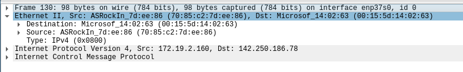

# Protocolul ICMP


Protocolul ICMP descris în [RFC 792](https://www.rfc-editor.org/rfc/rfc792) este folosit de routere în procesul de dirijare pentru a
transmite informații legate de conectivitatea la nivel IP și transport gazdelor
care au trimis datagrama în cauza. Protocolul ICMP se situează deasupra IP în
stiva de protocoale, dar nu este un protocol de transport, ci un protocol de
control (i.e. de debugging) pentru IP.

De exemplu, în anumite situații în care un pachet este aruncat de
router, un mesaj ICMP este generat de router și trimis către expeditorul
pachetului. În cadrul temei, ne vor interesa doar următoarele situații
și mesaje:

-   **Destination unreachable** (type 3, code 0) - Trimis în cazul în
    care nu există rută până la destinație, atunci când pachetul nu este
    destinat routerului.

-   **Time exceeded** (type 11, code 0) - Trimis dacă pachetul este
    aruncat din cauza expirării câmpului `TTL`.

Pentru ambele tipuri de mesaj de eroare, pachetul emis de router trebuie
să conțină, deasupra headerului ICMP, headerul de IPv4 al pachetului
dropped, precum și primii 64 de biți din
**payload-ul** pachetului original (adică doar ce se află deasupra
antetului IPv4).

De asemenea, routerul fiind și el o entitate în rețea, poate primi
mesaje ICMP de tip `"Echo request"` (type 8, code 0) destinate lui
însuși. Acesta trebuie să răspundă cu un mesaj ICMP de tip
`"Echo reply"` (type 0, code 0). În cazul acestor mesaje, octeții 4-5
din header capată semnificația unui "număr de identificare", iar octeții
6-7 ai unui "număr de secvență". Interpretarea acestora este de datoria
hostului care a emis pachetele ICMP, routerul trebuie doar să se asigure
că păstreze aceleași valori în pachetul de tip "Echo reply". Routerul
trebuie să trimită înapoi și orice date care se aflau deasupra antetului
ICMP în pachetul original.

Header-ul ICMP este următorul:
```
0                   1                   2                   3
0 1 2 3 4 5 6 7 8 9 0 1 2 3 4 5 6 7 8 9 0 1 2 3 4 5 6 7 8 9 0 1
+-+-+-+-+-+-+-+-+-+-+-+-+-+-+-+-+-+-+-+-+-+-+-+-+-+-+-+-+-+-+-+-+
|     Type      |     Code      |          Checksum             |
+-+-+-+-+-+-+-+-+-+-+-+-+-+-+-+-+-+-+-+-+-+-+-+-+-+-+-+-+-+-+-+-+
|                 Depends on type and code                      |
+-+-+-+-+-+-+-+-+-+-+-+-+-+-+-+-+-+-+-+-+-+-+-+-+-+-+-+-+-+-+-+-+
```

De exemplu, din [RFC 792 pagina 6](https://www.rfc-editor.org/rfc/rfc792),
aflăm că răspunsul de tip `Time Exceeded Message` o să conțină la final,
header-ul IP al pachetului aruncat și 64 de biți din datele cărate de IP, 
în acest caz un ICMP echo. Aveți mai jos o reprezentare a unui astfel de răspuns.


```
    0                   1                   2                   3
    0 1 2 3 4 5 6 7 8 9 0 1 2 3 4 5 6 7 8 9 0 1 2 3 4 5 6 7 8 9 0 1
   +-+-+-+-+-+-+-+-+-+-+-+-+-+-+-+-+-+-+-+-+-+-+-+-+-+-+-+-+-+-+-+-+
   |     Type      |     Code      |          Checksum             |
   +-+-+-+-+-+-+-+-+-+-+-+-+-+-+-+-+-+-+-+-+-+-+-+-+-+-+-+-+-+-+-+-+
   |                             unused                            |
   +-+-+-+-+-+-+-+-+-+-+-+-+-+-+-+-+-+-+-+-+-+-+-+-+-+-+-+-+-+-+-+-+
   |      Internet Header + 64 bits of Original Data Datagram      |
   +-+-+-+-+-+-+-+-+-+-+-+-+-+-+-+-+-+-+-+-+-+-+-+-+-+-+-+-+-+-+-+-+
```

> Pentru a înțelege mai bine funcționalitatea, vă recomandăm să urmăriți cu Wireshark răspunsurile routerului din casă.
De exemplu, daca rulăm `ping -c 1  -t 1 8.8.8.8` de pe calculatorul nostru, vom putea observa raspunsul de tip `Time Exceeded Message` trimis de către router.

Putem folosi următoarea structura pentru a reprezenta header-ul ICMP:

```c

struct icmphdr
{
  uint8_t type;                /* message type */
  uint8_t code;                /* type sub-code */
  uint16_t checksum;           /* checksum header */
  union
  {
    struct
    {
      uint16_t        id;
      uint16_t        sequence;     
    } echo;                        /* echo datagram. Vom folosi doar acest câmp din union */
    uint32_t        gateway;        /* Nu este relevant pentru tema */
    struct
    {
      uint16_t        __unused;
      uint16_t        mtu;
    } frag;                        /* Nu este relevant pentru tema */
  } un;
};
```

O captură de pachet ICMP request în Wireshark este următoarea:



