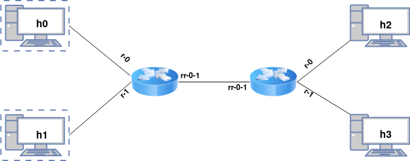

# Testare

Vom folosi mininet pentru a simula o rețea cu următoarea topologie:



Aveți la dispoziție un script de Python3, `topo.py`, pe care îl puteți
rula pentru a realiza setupul de testare. Acesta trebuie rulat ca
`root`:

    $ sudo python3 checker/topo.py

Astfel, se va inițializa topologia virtuală și se va deschide câte un terminal
pentru fiecare host și câte un terminal pentru fiecare router; terminalele pot
fi identificate după titlu.

Fiecare host e o simplă mașină Linux, din al cărei terminal puteți rula
comenzi care generează trafic IP pentru a testa funcționalitatea
routerului implementat. Vă recomandăm
[arping](http://man7.org/linux/man-pages/man8/arping.8.html),
[ping](https://linux.die.net/man/8/ping) și
[netcat](https://howto.lintel.în/listen-arbitrary-port-print-data-coming-using-netcat/).
Mai mult, din terminal putem rula `wireshark` sau `tcpdump` pentru a
face inspecția de pachete.

Pentru a compila codul vom folosi `make` care creează binarul `router`.

Pentru a porni routerele manual folosim următoarele comenzi, prima pe
router 0 și a doua pe router 1:

```bash
make run_router0    # din terminalul lui router0
make run_router1    # din terminalul lui router1
```

Ca sa nu scrieti manual ip-ul unui host, puteti folosii `h0`, `h1`, `h2` si `h3` in
loc de IP. (e.g. `ping h1`)
## Testare automată

> Înainte de a folosi testele automate, vă recomadam să folosiți modul interactiv
al temei pentru a vă verifică corectitudinea implementării. Testarea automată durează
câteva minute, așa că este mult mai rapid să testați manual.

Deasemenea, vă punem la dispoziție și o suită de teste:

```bash
$ ./checker/checker.sh
```

În urma rulării testelor, va fi generat un folder `host_outputs` care
conține, pentru fiecare test, un folder cu outputul tuturor hoștilor (ce
au scris la `stdout` și `stderr`). În cazul unui test picat, s-ar putea
să găsiți utilă informația de aici, mai ales cea din fișierele de
`stderr`. Folderul conține și câte un **fișier pcap** pentru fiecare router,
pe care îl puteți inspecta apoi în `Wireshark` (captura este făcută pe toate
interfețele routerului, deci pachetele dirijate vor apărea de două ori; urmăriți
indicațiile de [aici](https://osqa-ask.wireshark.org/questions/30636/traces-from-multiple-interface/)
pentru a obține o vizualizare mai bună).

Puteți rula un singur test folosind argumentul run <testname>. De exemplu:

```
sudo python3 checker/topo.py run router_arp_reply
```

Nu veți primi un raport *PASS/FAIL*, dar veți putea obține ușor outputul din `host_output`.


> **Notă:** Scopul testelor este de a ajuta cu dezvoltarea și evaluarea
temei. Mai presus de rezultatul acestora, important este să implementați
*cerința*. Astfel, punctajul final poate diferi de cel tentativ acordat
de teste, în situațiile în care cerința temei nu este respectată (un caz
extrem ar fi hardcodarea outputului pentru fiecare test în parte). Vă
încurajăm să utilizați modul interactiv al topologiei pentru a explora
și alte moduri de testare a temei (e.g. `ping`, `arping`).

Descrierea testelor automate este următoarea:
```
router_arp_reply - De pe h0 se trimite un ARP request către router; se verifică că routerul a trimis un reply; (practic un arping)
router_arp_request - De pe h0 se trimite un pachet către h1; ca routerul să-l poată livra, trebuie deci să trimită un ARP request către h1 - acesta e singurul verificat (nu se verifică dacă pachetul trimis de h0 chiar a ajuns pe h1)
forward - De pe h0 se trimite un pachet către h1, se verifică că a ajuns
forward_no_arp - De pe h0 se trimit, pe rând, două pachete către h1; pentru că routerul trebuie să rețînă informațiile primite de la un ARP reply, se verifică că pe h1 ajunge *cel mult* un ARP request
ttl - La fel că "forward", dar se verifică și dacă TTL-ul a fost decrementat
checksum - La fel că "forward", dar se verifică și dacă checksumul e corect
wrong_checksum - De pe h0 se trimite pe h1 un pachet IP cu checksum greșit; se verifică că nu ajunge pe h1
forwardXY - Se trimite un pachet de la hX la hY; în rest, identic cu "forward"
router_icmp - De pe h0, se trimite un ICMP echo request către router; se verifică că routerul răspunde
icmp_timeout - Se trimite de pe h0 un pachet cu TTL=1; se verifică că routerul răspunde cu ICMP time-exceeded
host_unreachable - Se trimite de pe h0 un pachet către un host necunosct; se verifică că routerul răspunde cu ICMP host-unreachable
forward10packets - Se trimit 10 pachete de la h0 la h1
forward10across - Se trimit 10 pachete de la h0 la h3 (deci trebuie să treacă prin două routere)
```


